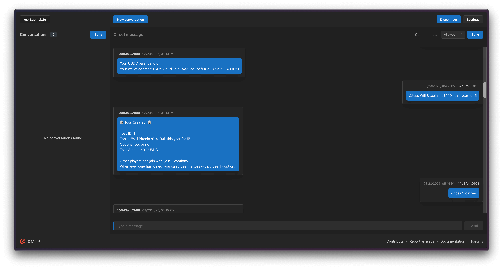

# Group Toss Agent

A coin toss agent built using CDP AgentKit that operates over the XMTP messaging protocol, enabling group coin toss on custom topics.



## Getting started

> [!TIP]
> See XMTP's [cursor rules](/.cursor/README.md) for vibe coding agents and best practices.

### Requirements

- Node.js v20 or higher
- Yarn v4 or higher
- Docker (optional, for local network)
- [OpenAI](https://platform.openai.com/api-keys) API key
- [Coinbase Developer Platform](https://portal.cdp.coinbase.com) (CDP) API credentials
- [USDC Faucet](https://faucet.circle.com/)

### Environment variables

To run your XMTP agent, you must create a `.env` file with the following variables:

```bash
WALLET_KEY= # the private key for the wallet
ENCRYPTION_KEY= # the encryption key for the wallet
# public key is

NETWORK_ID=base-sepolia # base-mainnet or others
OPENAI_API_KEY= # the OpenAI API key
CDP_API_KEY_NAME= # the name of the CDP API key
CDP_API_KEY_PRIVATE_KEY= # the private key for the CDP API key
XMTP_ENV=dev # local, dev, production
```

You can generate random xmtp keys with the following command:

```bash
yarn gen:keys
```

> [!WARNING]
> Running the `gen:keys` command will append keys to your existing `.env` file.

### Run the agent

```bash
# git clone repo
git clone https://github.com/ephemeraHQ/xmtp-agent-examples.git
# go to the folder
cd xmtp-agent-examples
cd examples/xmtp-group-toss
# install packages
yarn
# generate random xmtp keys (optional)
yarn gen:keys
# run the example
yarn dev
```

## Usage

The agent responds to commands in group chats when tagged with `@toss`:

### Available Commands

- `@toss <natural language toss>` - Create a toss using natural language
- `@toss join <tossId> <option>` - Join a toss and select your option
- `@toss close <tossId> <option>` - Close the toss and set the winning option (creator only)
- `@toss status <tossId>` - Check toss status and participants
- `@toss list` - List all active tosses
- `@toss balance` - Check your wallet balance

### Natural Language Examples

- `@toss Will it rain tomorrow for 5` - Creates a yes/no toss with 5 USDC
- `@toss Lakers vs Celtics game for .1` - Creates a toss with Lakers and Celtics as options

## FAQ

### How do I create a toss?

1. **Create a toss**: `@toss Will Bitcoin hit $100k this year for .5`
2. **Join the toss**: `@toss join 1 yes` (other players must choose an option)
3. **Check status**: `@toss status 1`
4. **Close the toss**: `@toss close 1 yes` (creator decides the winning option)
5. **View results**: All players who chose the winning option share the prize pool

### The agent workflow:

1. Users create or join tosses in group chats
2. Each player is assigned a unique wallet
3. The toss creator determines the winning option when closing the toss
4. Prize money is split among all players who chose the winning option
5. Transaction confirmations are provided in the chat

### Prize Distribution

- All tosses are collected in a dedicated toss wallet
- When the toss is closed, the creator chooses the winning option
- All players who chose the winning option share the prize pool equally
- Automatic transfers are sent to each winner's wallet
- Transaction confirmations are provided in the chat
